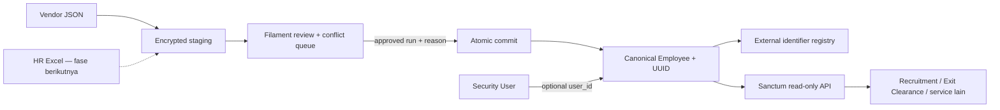

# Employee Identity Hub — Phase 1

## Tujuan

Plugin Kepegawaian menjadi **People & Access Control Plane** milik perusahaan:

- satu UUID karyawan yang stabil untuk dipakai semua service;
- satu registry external identity untuk menghubungkan ID vendor tanpa fuzzy match;
- import vendor melalui staging, review, dan commit yang dapat diaudit;
- API internal read-only untuk konsumsi service lain;
- Filament sebagai layar operasional, konflik, dan pembagian privilege.

Phase ini belum menjadikan Laravel sebagai Identity Provider OIDC/SAML. Login lintas aplikasi, lifecycle akses, adaptor Excel, serta integrasi rekrutmen dan exit-clearance adalah fase berikutnya. Laravel tetap menjadi sumber kebijakan dan relasi orang-akun; autentikasi federation dapat ditambahkan setelah registry orang stabil.



## Batas source of truth

| Data | Source of truth Phase 1 | Aturan |
|---|---|---|
| Canonical employee ID | `employees_employees.uuid` | UUID wajib, unik, dan tidak dapat diubah |
| Kode/nama/status profil | `employees_employees` | Perubahan terkontrol melalui Kepegawaian |
| Akun login | `users` pada plugin Security | Diikat secara opsional melalui `employee.user_id` |
| ID dari vendor/service | `employees_employee_identifiers` | Exact match berdasarkan source tuple; ownership tidak dapat dipindah diam-diam |
| File vendor | `employees_sync_runs` + source records | Staging terenkripsi, bukan langsung menulis master |
| HR Excel | Belum diaktifkan | Nantinya masuk adaptor staging yang sama, bukan write langsung |

Kunci external identity adalah:

```text
(source_system, source_instance, identifier_type, normalized external_id)
```

Contoh: `(talenta, production, record_id, vendor-100)`. Jangan gunakan email pribadi sebagai identity key dan jangan membuat link otomatis hanya berdasarkan kemiripan nama.

## Instalasi dan upgrade

Aktifkan plugin Kepegawaian melalui Plugin Manager atau command instalasi yang berlaku di environment, kemudian jalankan migration:

```bash
php artisan kepegawaian:install
php artisan migrate
```

Migration `2026_07_19_000004_harden_employee_sync_tables` juga menangani database yang pernah menjalankan schema sync versi awal. Scalar sensitif lama dienkripsi, blind index diisi, dan index plaintext diganti. Run lama tidak diberi manifest secara retroaktif; file tersebut harus di-stage ulang sebelum boleh di-commit.

Sebelum deployment production:

1. Ambil backup database.
2. Deploy code dan jalankan `php artisan migrate` dalam maintenance window.
3. Generate/sinkronkan permission Shield dan berikan hanya ke role yang tepat.
4. Stage satu export kecil sebagai pilot, cocokkan checksum dan jumlah data.
5. Commit setelah konflik dan jumlah `would_create` ditinjau.

Prasyarat runtime production:

- `APP_KEY` wajib tersedia dan stabil; rotasi key harus disertai prosedur re-enkripsi data staging dan audit lama.
- Cache lock harus memakai backend bersama seperti Redis/database bila aplikasi berjalan pada beberapa host atau worker.
- Migration hardening diuji otomatis pada SQLite dan mengeksekusi pelebaran kolom khusus MySQL; lakukan smoke migration pada salinan database MySQL sebelum rollout production.
- Raw SQL/akses database dibatasi; perubahan identity harus melewati model, policy, dan service terotorisasi.

## Alur import JSON vendor

### 1. Stage — tidak mengubah master

```bash
php artisan kepegawaian:sync-employees-json \
  /absolute/path/list-employee.json \
  --source-system=talenta \
  --source-instance=production
```

Command menghasilkan UUID dry-run dan ringkasan `matched`, `would_link`, `would_create`, `conflict`, serta `invalid`. File dibaca satu kali di bawah shared lock, dibatasi 25 MB, dan setiap record dibatasi 256 KB.

### 2. Review di Filament

Buka menu Employee Sync Runs dan Employee Sync Conflicts. Pastikan:

- checksum file sesuai export yang disetujui;
- jumlah record dan seluruh klasifikasi masuk akal;
- `would_create` memang karyawan baru;
- kandidat yang hanya cocok melalui `employee_code` tidak di-link otomatis;
- retired ID, perubahan kode, dan dua ID aktif dari source yang sama diselesaikan sebagai konflik.

Snapshot dilindungi HMAC manifest. Manifest mengikat payload terenkripsi, checksum, blind index, ringkasan review, hasil klasifikasi source record, dan descriptor konflik. Perubahan setelah review membuat commit gagal dan operator harus melakukan staging ulang.

### 3. Commit reviewed run

```bash
php artisan kepegawaian:sync-employees-json \
  --commit-run=UUID_DRY_RUN \
  --actor=USER_ID_APPROVER \
  --reason="HR menyetujui checksum dan seluruh konflik pada export ini"
```

Commit memiliki karakter berikut:

- membutuhkan user aktif dengan permission commit khusus;
- reason wajib dan disimpan terenkripsi;
- hanya menggunakan payload staging, bukan membaca ulang file;
- satu transaksi untuk semua canonical write;
- source-level lock mencegah dua commit bersamaan;
- dry-run yang sukses hanya dapat di-commit satu kali;
- karyawan baru dibuat dalam keadaan `is_active = false`;
- record yang hilang dari snapshot tidak otomatis menonaktifkan karyawan;
- kegagalan pada satu row menggagalkan seluruh canonical mutation.

`--actor` adalah identitas approver yang dicatat, bukan bukti login shell. Karena itu akses menjalankan Artisan harus dibatasi pada administrator/automation yang tepercaya. Jangan expose command ini sebagai input bebas dari aplikasi lain. Approval berbasis UI atau signed service identity dapat ditambahkan pada fase access-governance.

## Permission minimum

| Kebutuhan | Permission |
|---|---|
| Melihat registry | `view_any_kepegawaian_employee`, `view_kepegawaian_employee` |
| Mengelola external ID | `manage_identifiers_kepegawaian_employee` |
| Melihat audit run | `view_any_kepegawaian_employee::sync::run`, `view_kepegawaian_employee::sync::run` |
| Commit dry-run | `commit_kepegawaian_employee::sync::run` |
| Melihat konflik | `view_any_kepegawaian_employee::sync::conflict`, `view_kepegawaian_employee::sync::conflict` |
| Resolve/reject konflik | `resolve_kepegawaian_employee::sync::conflict` |

Permission `update_kepegawaian_employee` tidak memberikan hak mengelola external identity. Mengubah profil, mengikat ID vendor, menyelesaikan konflik, dan menyetujui commit adalah empat boundary berbeda.

## API internal

Endpoint memakai middleware `auth:sanctum` dan Employee policy:

```text
GET /admin/api/v1/kepegawaian/employees
GET /admin/api/v1/kepegawaian/employees/{employee_uuid}
GET /admin/api/v1/kepegawaian/employees/resolve
```

Contoh exact resolver:

```http
GET /admin/api/v1/kepegawaian/employees/resolve?source_system=talenta&source_instance=production&identifier_type=record_id&external_id=vendor-100
Authorization: Bearer <sanctum-token>
Accept: application/json
```

List mendukung `filter[employee_code]`, `filter[name]`, `filter[company_id]`, `filter[is_active]`, dan `per_page` maksimum 100. Respons registry sengaja tidak memuat password, personal access token, metadata import mentah, email pribadi, alamat, atau field payroll.

Consumer service harus menyimpan `employee_uuid` sebagai referensi lintas sistem. Numeric database ID hanya untuk relasi internal satu database dan tidak boleh menjadi kontrak integrasi.

## Roadmap setelah Phase 1

1. **Excel adapter:** baca workbook HR ke staging yang sama, tampilkan mapping kolom/sheet dan reconciliation report.
2. **Person/employment decomposition:** bila kebutuhan multi-company/rehire sudah nyata, pecah profil orang dari employment tanpa mengganti UUID kontrak.
3. **Recruitment:** applicant yang hired membuat/mengikat canonical employee UUID; tidak membuat master paralel.
4. **Exit clearance:** offboarding mengacu ke employee UUID, lalu menghasilkan entitlement revoke tasks dan evidence.
5. **Access governance:** application, role, entitlement, approval, recertification, dan segregation-of-duties.
6. **SSO federation:** expose/consume OIDC melalui komponen yang diaudit; jangan membangun protokol login dan token secara manual.
